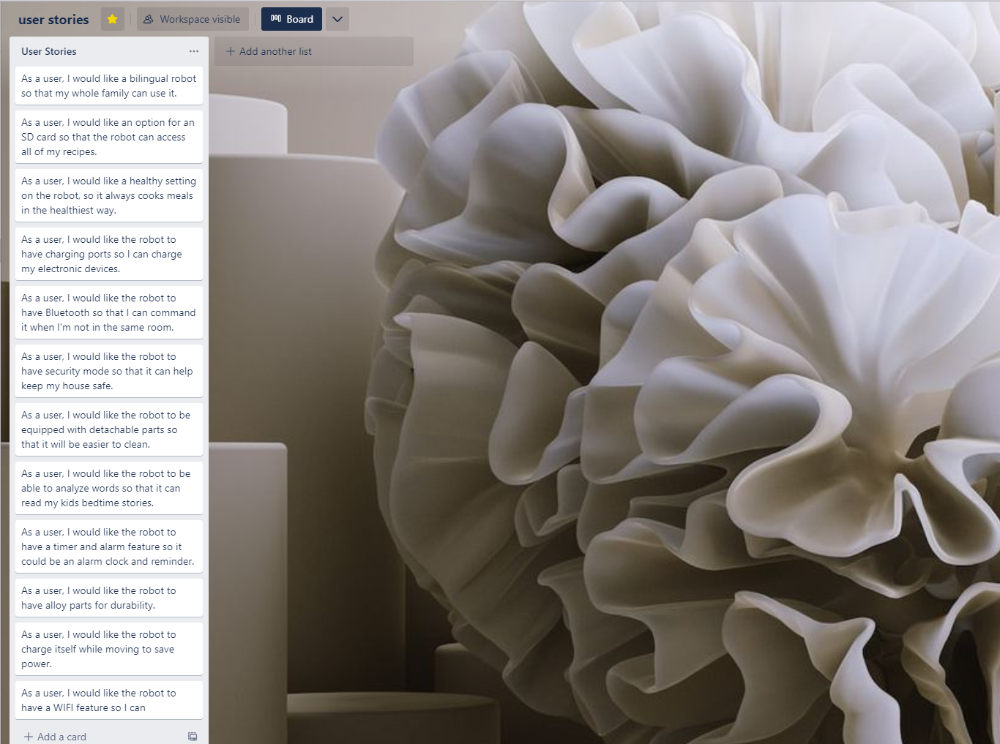

# RT5000-Application
### By Stephan & Joy 🧑‍🤝‍🧑

## Interveiw Questions for Requirments
---
## Chili & Rice 🍚 
1. What kind of beans would you like
2. What kind of base would you like for you chili
3. Do you want this dish vegetartian or not
4. what kind of meat do you want in your chili
5. what other vegetables would you like in your chili
6. What kind of rice would like
7. Would you like chesee in your chili
8. Would you like sour cream or any other dairy in your chili
9. How would you like your rice cooked
10. What toppings would you like ?

## Chef Salads 🥗
1. what kind of lettuce would you like
2. What kind of dressing would you like
3. Crutons or no crutons?
4. Low calorie dressing ?
5. Would you like to use baby spinach instead?
6. What kind of deli meat would you like on it
7. Would you prefer a meat substitute
8. Would you like it mixed or all the ingreiants placed on top
9. Would you like a bacon subsittute
10. How much dressing would you like.

## Tuna fish sandwich 🐟
1.  Do you want a plain tuna fish sandwich or a heartier tuna fish sandwich?
2.  Do you want extra ingredient like onion, celery, or eggs?
3.  Do you want spicy or original tuna?
4.  What kind of bread do you want with the sandwich?
5.  How many pieces of bread do you want on the sandwich?
6.  Would you like your bread to be toasted?
7.  Do you want a hot or cold sandwich?
8.  How many servings would you like?
9.  What kind of condiments would you like on your sandwich?
10. How much of each condiment would you like?
11. Do you want fresh or canned tuna fish? 

## Chicken Soup 🐥
1.  Do you want homemade or canned chicken soup?
2.  How many servings do you want me to make?
3.  Do you want carrots in your chicken soup?
4.  Do you want chicken on the bone or boneless chicken?
5.  Do you want light or dark meat chicken?
6.  Do you want water or broth?
7.  Do you want the chicken soup plain or seasoned well?
8.  Do you want your chicken soup creamy?
9.  How hot do you want your chicken soup?
10. Do you want noodles or no noodles in your chicken soup?
---
---
# User Stories

---
---
## Top 10 List of Requirments
1. **Bilingual options on the robot**- to expand the market gloabally so more people can access it
2. **Bluetooth options** - to play your spotify or your audiobooks, could theoritically read your kids bedtime stories
3. **SD card**- so you could upload music and recipes without the wifi feature
4. **Detachable and washable parts**- to make cleaning the robot easy
5. **Timer and alarm**- since its cooking for you a timer feature should be a key piece and an alarm feature should also be added 
6. **Alloy parts**- for durability reasons, especially for the wheels and joints-
7. **Health mode**- so the robot would make any recipe the healthiest way possible and potrion you correctly when cooking 
8. **Self charging battery**- green features always sell well and everyone wants to save on power
9. **Wifi feature**- to download things like recipies playlists and books striaght to the robot 
10. **Charging ports**- to charge your electronics on, emergency changing capabilities in a power outage
